### 👋 Hi there, I'm Aryan!

Full-stack developer with a JavaScript/Node.js background, currently branching into Python and AI-adjacent tooling. I build complete, deployed products rather than tutorials-left-half-finished — most of my repos are full-stack apps with a real frontend, backend, and database behind them.

---

### 🛠️ When I code, I rely on

---

### 🚀 Featured Projects

#### ⚔️ [CodeClash](https://github.com/Aryannaik-max/CodeClash)
A **1v1 real-time competitive programming platform** — a head-to-head coding duel arena.
- Built with **Next.js, TypeScript, Express, Redis, and PostgreSQL**
- **Monaco Editor** integrated for an in-browser coding experience
- Real-time **WebSocket matchmaking** via Socket.IO
- GitHub OAuth + email/password auth, with **Redux Toolkit** managing frontend auth state
- Custom **pixel-art western theme** — sunset gradients, wood textures, a hand-built "Wanted Poster" profile page using SVG and clip-path corners, Press Start 2P typography
- Backend hardened with a **Prisma transaction fix** for a match-creation race condition; DB migrated to **Neon** after a large-row OOM issue on the free tier
- In progress: pluggable code-execution/judge service (Wandbox/Judge0)

#### 🪐 [Novaspace](https://github.com/Aryannaik-max/Novaspace) + [Novaspace-Backend](https://github.com/Aryannaik-max/Novaspace-Backend)
A **real-time collaborative workspace app** in the spirit of Notion/Linear — workspaces, live collaborative documents, task boards, file sharing, and team chat.
- **React + Vite** frontend, deployed on Vercel
- **Liveblocks** for real-time presence/collaboration
- **Tailwind CSS** for styling, **JWT** for auth
- Split into dedicated frontend and backend repositories

---

### 🧠 Beyond the Code

I'm also active in **competitive programming** — working through Codeforces and CodeChef contests and LeetCode by pattern (sliding window, two pointers, binary search, hashing, monotonic stacks), which feeds directly into how I think about performance and edge cases in my projects (like the CodeClash judge pipeline).

---

### 📊 GitHub Stats

  
  

  

---

### 📫 Let's Connect

Open to remote full-stack opportunities — feel free to check out [CodeClash](https://github.com/Aryannaik-max/CodeClash) or [Novaspace](https://github.com/Aryannaik-max/Novaspace).

<!--
Rendering notes:
- Profile views badge (komarev) is a live third-party service and renders on its own.
- Stats, top-languages, and streak cards are now self-hosted: a GitHub Actions workflow
  (.github/workflows/update-readme-cards.yml) regenerates them as static SVGs and commits
  them into ./profile/ once a day. This avoids the public Vercel/Heroku instances entirely,
  so they won't go blank from rate limiting.
- Setup: place both this README.md and the .github/workflows folder in a repo named
  EXACTLY `Aryannaik-max` (GitHub's special "profile README" repo), then go to the
  Actions tab and manually run "Update README cards" once (workflow_dispatch) so the
  SVGs exist before anyone views the profile. After that it refreshes daily on its own.
-->
